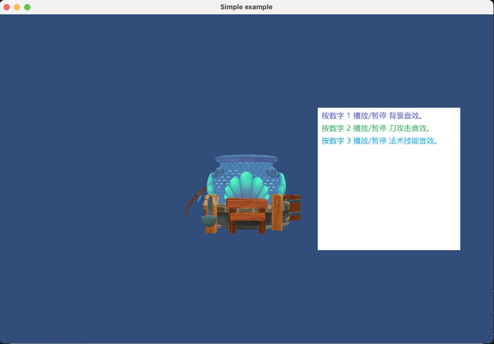

# Reading && Implementation
reference: [ Writing a game engine tutorial from scratch](https://github.com/ThisisGame/cpp-game-engine-book)
# Simple Game Engine
## 00-Build OpenGL Enviroment
### Sub Steps:
+ 00-glfw_empty_window
GLFW Empty Window

## 01-Draw Polygon
### Sub Steps:
+ 01-draw_polygon_00_draw_triangle
+ 01-draw_polygon_01_draw_triangle_vao
+ 01-draw_polygon_02_draw_quad
+ 01-draw_polygon_03_draw_cube

### Screenshot:
Draw Triangle

Draw Quad

Draw Cube

## 02-Draw Texture
### Sub Steps:
+ 02_texture_00_load_image
+ 02_texture_01_draw_cube_texture
+ 02_texture_02_draw_cube_texture_compress
+ 02_texture_03_export_compressed_texture_tools
+ 02_texture_04_draw_cube_compress_texture

### Screenshot:

Draw Cube

## 03-Vertex Index and Buffer 
### Sub Steps:
+ 03_vertex_index_and_buffer_00_vertex
+ 03_vertex_index_and_buffer_01_indices
+ 03_vertex_index_and_buffer_02_buffer_object
+ 03_vertex_index_and_buffer_03_vao

### Screenshot:
Draw Cube

## 04-Draw Mash and Material
### Sub Steps:
+ 04_mesh_and_material_00_export_mesh_file
+ 04_mesh_and_material_01_load_mesh_file
+ 04_mesh_and_material_02_use_shader_file
+ 04_mesh_and_material_03_use_material
+ 04_mesh_and_material_04_mesh_renderer

### Screenshot:
Draw Cube

## 05-Draw Static Mesh
### Sub Steps:
+ 05_export_blender_00_load_mesh_from_blender

### Screenshot:
Draw Mesh

## 06-Component Base Develepment
### Sub Steps:
+ 06_component_00_test_rttr
+ 06_component_01_gameobject_component

### Screenshot:
Draw Mesh

## 07-Camera
### Sub Steps:
+ 07_camera_00_perspective_camera
+ 07_camera_01_two_camera
+ 07_camera_02_camera_depth
+ 07_camera_03_cullingmask

### Screenshot:
Two Camra

Camera Depth

## 08-Control System
### Sub Steps:
+ 08_mouse_00_key_callback
+ 08_mouse_01_key_mouse_callback

## 09-Split To Engine And Application
### Sub Steps:
+ 9_make_engine_as_framework_00_split_engine_code

## 10-Draw Font
### Sub Steps:
+ 10_draw_font

### Screenshot:
Draw Font

## 11-GUI
### Sub Steps:
+ 11_ui

### Screenshot:
GUI

## 12-Audio
### Sub Steps:
+ 12_audio_00_fmod_play_2d_audio
+ 12_audio_01_audio_source_3d
+ 12_audio_02_load_bank

### Screenshot:
2D Audio

2D Audio

## 13-Profiler
### Sub Steps:
+ 13_profiler_00_easy_profiler

## 14-Integrator Lua
### Sub Steps:
+ 14_lua_integrate_01_lua_call_cpp_sol2
+ 14_lua_integrate_00_lua_call_cpp_wrap
+ 14_lua_integrate_02_lua_call_cpp_sol2_component
+ 14_lua_integrate_03_lua_call_cpp_sol2_component_lua_wrap
+ 14_lua_integrate_04_lua_component

## 15-Skeleton Animation
### Sub Steps:
+ 15_skeleton_animation_load_skeleton_animation

## 16-Skinned Mash Rendering
### Sub Steps:
+ 16_skinned_mesh_renderer_00_simple_skinned_mesh_renderer
+ 16_skinned_mesh_renderer_01_bone_weight
+ 16_skinned_mesh_renderer_02_load_weight_file
  
### Screenshot:
Simple Skinned Mesh

Bone Weight

## 17-Parse FBX File
### Sub Steps:
+ 17_load_fbx_00_extra_mesh
+ 17_load_fbx_01_extra_mesh_with_normal
+ 17_load_fbx_02_extra_skeleton_animation
+ 17_load_fbx_03_extra_weight
+ 17_load_fbx_04_load_skinned_mesh

### Screenshot:
Skinned Mesh

## 18-Multi Thread Rendering
### Sub Steps:
+ 18_multithread_render_00_glfw_multithread
+ 18_multithread_render_01_render_task_queue
+ 18_multithread_render_02_gpu_resource_handle
+ 18_multithread_render_03_engine_render_queue

## 19-Classic Lighting
### Sub Steps:
+ 19_classic_lighting_00_ambient
+ 19_classic_lighting_01_diffuse
+ 19_classic_lighting_02_specular_highlight
+ 19_classic_lighting_03_specular_map
+ 19_classic_lighting_04_light_struct
+ 19_classic_lighting_05_ubo
+ 19_classic_lighting_06_directional_light
+ 19_classic_lighting_07_point_light
+ 19_classic_lighting_08_multi_light
  
### Screenshot:
Ambient

Diffuse

Specular HightLight

Specular Map

Directional Light

Point Light

Multi Light

## 20-Engine Editor
### Sub Steps:
+ 20_engine_editor_00_core_and_application_layer
+ 20_engine_editor_01_imgui_editor_not_share_context
+ 20_engine_editor_02_imgui_editor_share_context
+ 20_engine_editor_03_hierarchy_and_inspector

### Screenshot:
Split To Core And Application

Not Share Window Context

Share Window Context

Hierarchy And Inspector

## TODO
Shadow Mapping 

Physics

Deferred Rendering

PBR